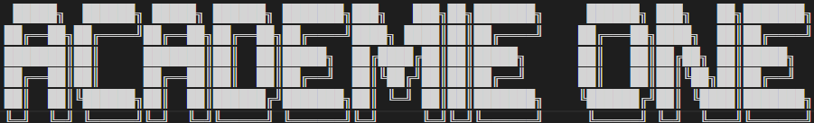
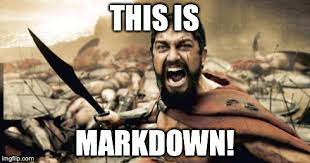
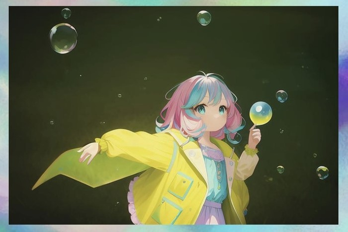
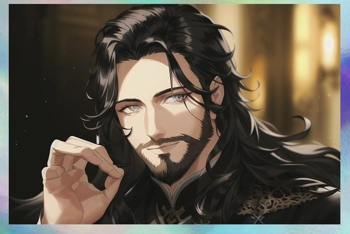
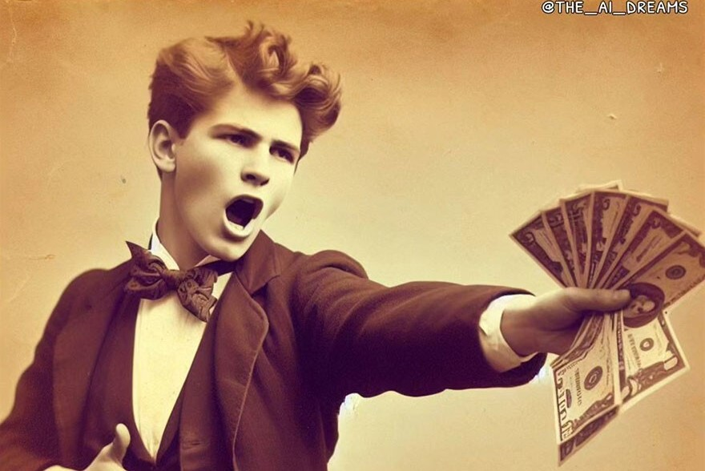
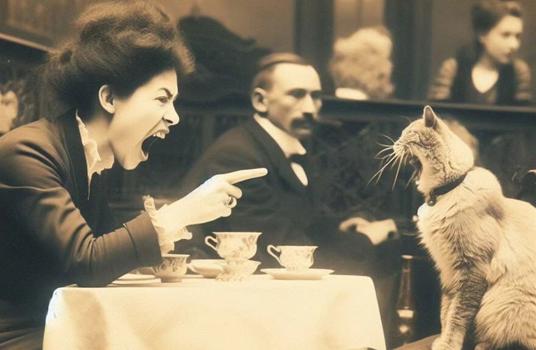
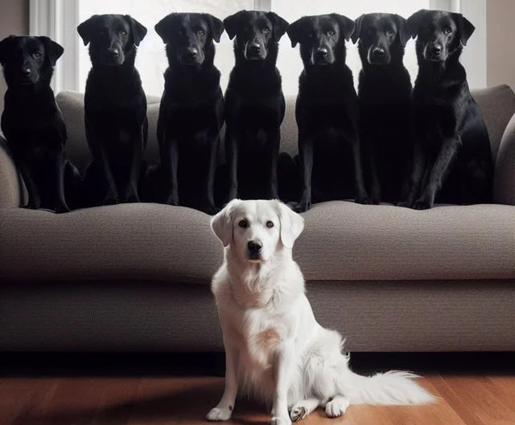
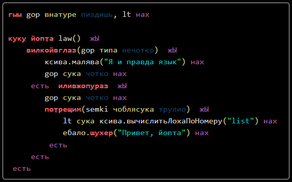
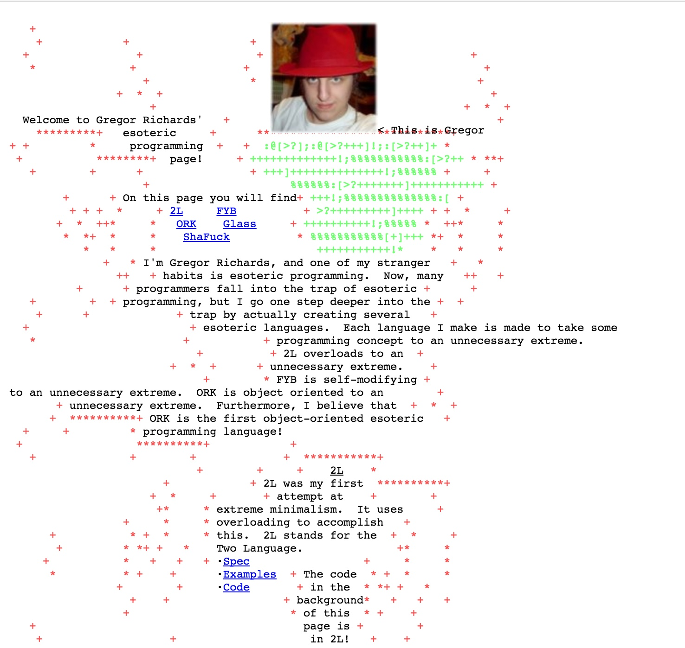
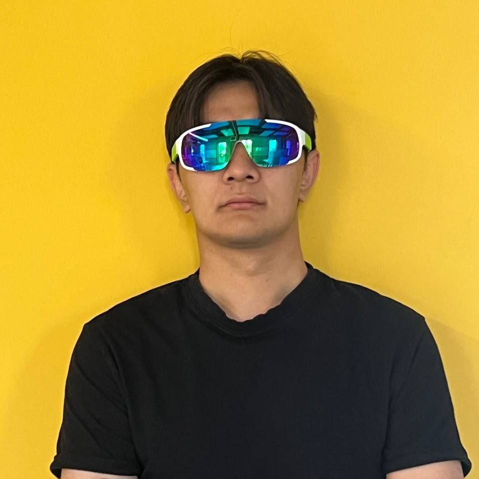

#  Влияние ИИ и нейросетей на развитие мем-индустрии
<div id="header" align="center" >

  
  
</div>

Каждый пользователь интернета так или иначе сталкивался с мемами на его просторах, и это не удивительно, так как иногда мы не можем подобрать лучшего способа передать свои эмоции, чем использовать юмористическую картинку, которая заставит улыбнуться собеседника или читателей. И если раньше все было более-менее понятно и мемы к нам приходили из завирусившихся видео или легендарных сериалов, то с развитием искусственного интеллекта для мем-индустрии открылся горизонт невиданных возможностей.
| | | |
|:-------------------------:|:-------------------------:|:-------------------------:|
|   |  ||
|  |  ||
<div id="header" align="center" >

  
  
</div>

<!--  -->

## 

Правда, искусственный интеллект еще только учится распознавать, что же от него требуют люди и не всегда справляется с поставленной перед ним задачей, по крайней мере, не так, как это может представлять себе человек. 

# 🌟 Интересное
В IT – сфере юмор иногда бывает настолько специфическим, что даже отдельные языки программирования могут стать своеобразным подобием представителей мем-индустрии. 


- **YoptaScript**: язык, который транслируется в чистый JavaScript, он заявлен как «язык программирования» для гопников и реальных пацанов и был создан для того, чтобы позволить «четким пацанам» быстро влиться в ряды программистов и процесс разработки.

<div id="header" align="center" >

  
  
</div>

- **Glass**: создан в 2005 году Грегором Ричардсом. Структурно язык весьма сложный, так как сочетает в себе использование постфиксов, и требует серьезных манипуляций с основным стеком в сочетании с его объектно-ориентированной структурой.
<div id="header" align="center" >

  
  
</div>
Вот как выглядит последовательность Фибоначчи:

```bash
{F[f(_a)A!(_o)O!(_t)$(_n)1=,(_isle)(_n)*(_a)(le).?=/(_isle)^\(_n)*(_a)
s.?(_t)f.?(_n)*(_a)s.?(_t)f.?(_a)a.?]}{M[m(_a)A!(_f)F!(_o)O!(_n)=(_nlm)
=/(_nlm)(_n)*(_f)f.?(_o)(on).?" "(_o)o.?(_n)(_n)*(_a)a.?=(_nlm)(_n)*
(_a)(le).?=\]}
```
<div id="header" align="center"  style="display: flex; justify-content: space-around;">
 <figure style="margin: 0;">

<figcaption>gshaken</figcaption>
 </figure>
 <figure style="margin: 0;">

<figcaption >vinq</figcaption>
 </figure>
  <figure style="margin: 0;">

<figcaption>tkural</figcaption>
</figure>
</div>


[](https://git.io/streak-stats)


